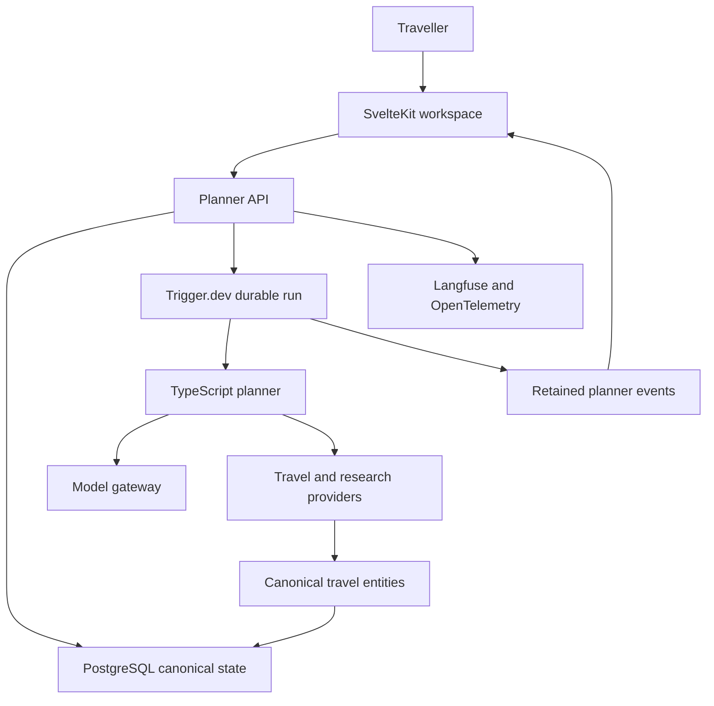
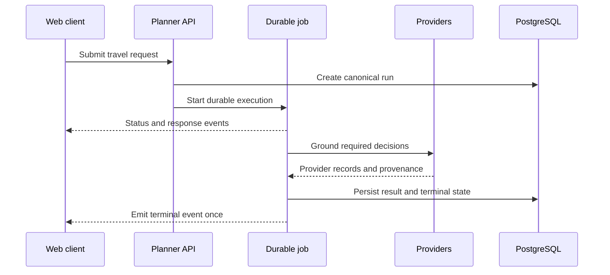

# Vacay Agent — engineering case study

A durable, source-grounded AI travel-planning workspace built around streamed conversations, real provider research, and targeted updates to a versioned trip graph.

> This repository is a public engineering case study. The product source remains private. The examples here are sanitized extracts that demonstrate architecture and reliability patterns without exposing credentials, private prompts, provider agreements, or user data.

## The product problem

Travel planning is not a single search. A useful system has to move between inspiration, constraints, live inventory, comparison, itinerary building, and later edits without losing the traveller’s intent or rewriting work they already approved.

Vacay was designed around four requirements:

1. Recommendations should be grounded in current provider evidence.
2. Long-running work should remain understandable while it executes.
3. Reloading or switching conversations should not lose an active run.
4. Editing one part of a trip should not regenerate unrelated decisions.

## My work

The work represented in this case study spans:

- Product definition and interaction design
- SvelteKit application architecture
- TypeScript agent orchestration and tool contracts
- Provider integration and canonical data modelling
- PostgreSQL schemas and persistence
- Durable Trigger.dev execution
- Stream projection, cancellation, retry, and reload recovery
- Langfuse and OpenTelemetry instrumentation
- Automated tests for planner events, document extraction, provider research, semantic recall, and targeted trip patches

## System architecture



The monorepo separates the web product, planner API, agent runtime, shared domain contracts, database package, and reusable UI. PostgreSQL is the canonical application state; retained planner events provide the live projection while a run is active.

## One response, several event types

A planner response is represented as one ordered event stream:

```text
status → text → grounded card → text → sources → terminal state
```

Cards do not become detached messages, and a reload does not wait for the full model response before showing progress. Every event carries a stable run identifier and monotonic sequence so the client can apply it idempotently.



## Targeted trip mutations

Vacay models a trip as typed nodes and edges. Destinations, route stops, stays, activities, transport, budgets, bookings, and checklists have different identities and lifecycles.

When a traveller changes one hotel or activity, the planner:

1. Resolves the target node and minimum dependent context.
2. Runs only the tools required to ground that change.
3. Compiles a typed `add`, `replace`, or `remove` operation.
4. Validates the operation against the section contract.
5. Updates the graph projection and compatibility snapshot transactionally.
6. Records a new node revision and invalidates only affected prompt segments.

This prevents a small edit from silently replacing unrelated itinerary work.

## Provider grounding

The planner normalizes provider results into canonical destinations, airports, properties, attractions, and activities before they enter a trip.

```text
query
  → canonical entity
  → provider candidates
  → provider identity links
  → sourced facts and media
  → trip-node selection
```

Every surfaced claim or visual retains its source, provider identity, canonical entity, and available attribution. Provider failures remain visible instead of being replaced with plausible model-generated details.

The private system contains adapters for travel inventory, places, maps, weather, events, and web research. This case study describes their shared contracts without publishing credentials or partner-specific implementation details.

## Reliability decisions

### Durable execution

Planner work runs outside the request lifecycle. A browser disconnect or page reload does not terminate the underlying job.

### Canonical completion

Nonterminal events can stream quickly, but a terminal event is emitted only after the final message and application state are stored. Completed conversations read canonical PostgreSQL records instead of replaying an old ephemeral stream.

### Idempotent projection

The client deduplicates events by run and sequence. Reconnecting can replay retained events without duplicating text or cards.

### Targeted repair

Invalid tool arguments, incomplete provider records, malformed structured responses, and constraint violations are handled through bounded validation and repair paths. Retry limits and failure policy belong to the runtime rather than being delegated entirely to the model.

### Explicit cancellation

Cancellation prevents queued nonterminal output from continuing to reach the user and records a distinct terminal state.

## Test evidence

The private implementation contains focused tests for:

- Agent-message execution
- Planner event ordering and terminal-state policy
- Structured response parsing
- Document extraction
- Provider research
- Semantic recall
- Project persistence
- Targeted trip patches
- Trip-graph integrity and revisions

This public repository will include small, sanitized contract and projection examples. It will not claim comprehensive evaluation coverage until the planned dataset and regression suite are complete.

## Stack

- TypeScript
- Svelte 5 and SvelteKit
- Vercel AI SDK-compatible model and tool interfaces
- PostgreSQL, Neon, and Drizzle ORM
- Trigger.dev
- Better Auth
- Langfuse and OpenTelemetry
- S3-compatible file storage
- Vitest
- Travel, mapping, weather, places, and research providers behind normalized adapters

## What I would measure next

The next evaluation layer should turn product expectations into a repeatable dataset:

- Constraint satisfaction
- Source coverage and unsupported-claim rate
- Provider success and fallback rate
- Targeted-patch correctness
- Duplicate-event and resume failures
- First meaningful response latency
- End-to-end completion latency
- Token and provider cost per completed planning task
- Human preference across itinerary alternatives

The evaluation plan is intentionally listed as future work rather than presented as completed production evidence.

## Public case-study map

- [`docs/architecture.md`](./docs/architecture.md) — service boundaries and canonical state
- [`docs/durable-streaming.md`](./docs/durable-streaming.md) — event ordering, reload recovery, and cancellation
- [`docs/provider-grounding.md`](./docs/provider-grounding.md) — normalization, provenance, and failure behaviour
- [`docs/trip-graph-mutations.md`](./docs/trip-graph-mutations.md) — stable nodes, patches, revisions, and invalidation
- [`docs/testing-and-evaluation.md`](./docs/testing-and-evaluation.md) — current test evidence and the planned evaluation suite

## Disclosure

This case study describes an independently built product prototype. It does not claim live booking inventory, commercial provider partnerships, production scale, customer adoption, or completed LLM evaluation coverage where those have not been verified.
