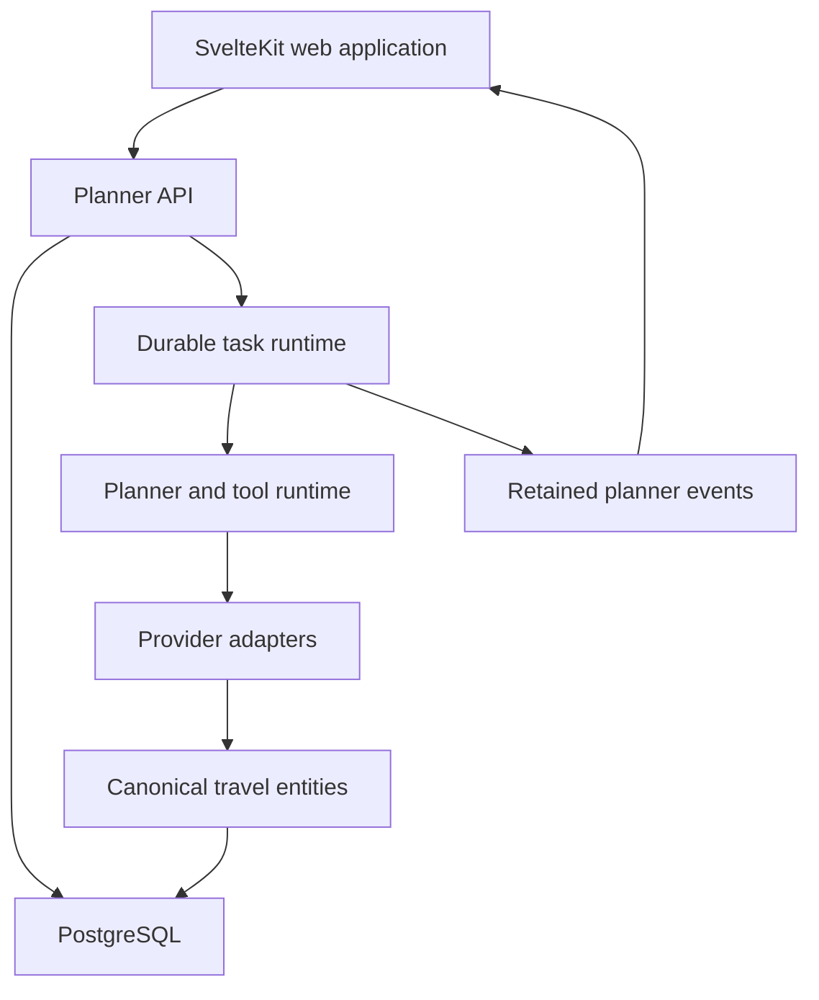

# Architecture

Vacay separates the interactive product from durable planner execution. The browser is not responsible for keeping an agent run alive, and the agent runtime is not the canonical store for product state.

## Service boundaries

The private monorepo is divided into a web application, planner API, agent runtime, shared domain contracts, database package, and shared UI package.

## Canonical state

PostgreSQL owns durable product state:

- Users, projects, conversations, and canonical messages
- Planner runs and terminal status
- Trips, typed graph nodes, edges, revisions, and artifacts
- Canonical travel entities and provider identities
- Source and media provenance
- Shared provider quotas and request telemetry

Retained events are a transport and recovery mechanism for an active run. They do not replace canonical messages after completion.

## Request boundary

The web application talks to the planner through an internal API boundary. Model-provider keys, travel-provider credentials, and privileged storage operations stay on the server. Durable work begins only after the API creates a stable run identity.

## Design constraints

1. A process restart must not invalidate an accepted planning request.
2. A reconnect must not duplicate text, cards, or terminal state.
3. Provider data must retain provenance after normalization.
4. A targeted trip edit must not regenerate unrelated nodes.
5. Provider and persistence failure must remain visible to the product.

## Repository boundaries

The public examples in this case study are rewritten around the same invariants, but they are not source drops from the private product. Names and types are intentionally smaller so the architecture can be evaluated without exposing operational details.

