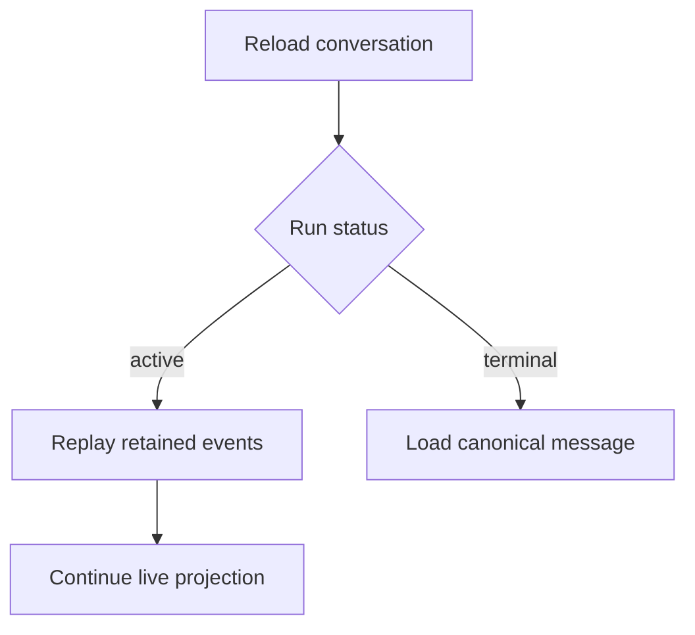

# Durable streaming and reload recovery

A long-running planner cannot rely on one browser request remaining connected. Vacay gives the durable job, retained event stream, and canonical database record different responsibilities.

## Event lifecycle

```text
accepted → running → completed | failed | cancelled
```

Every event carries:

- A stable run identifier
- A monotonic sequence number
- A typed payload
- A creation time
- A terminal flag when applicable

The client projects nonterminal events into one ephemeral assistant message. It deduplicates by run and sequence, which makes replay safe after a reconnect.

## Completion rule

The runtime persists the final message and related product state before it emits `completed`. After completion, the application reads the canonical message from PostgreSQL instead of reconstructing it from retained events.

This ordering prevents three common failures:

1. The interface announces completion before the result can be loaded.
2. A reload displays both a replayed stream and the saved message.
3. A terminal event is emitted twice after a retry.

## Reload behaviour



The server resolves project, conversation, and canonical message state during the initial render. The client resumes only the active stream projection, avoiding a false empty state during hydration.

## Cancellation

Cancellation is a recorded terminal outcome. Once accepted, queued nonterminal events are no longer delivered. Provider requests that cannot be interrupted may finish internally, but their results cannot mutate the cancelled run.

## Failure policy

Tool arguments, provider responses, structured model output, and database mutations are validated at their boundaries. Repairs are bounded by retry policy. A failure that cannot be repaired becomes an explicit terminal event rather than plausible fallback prose.

