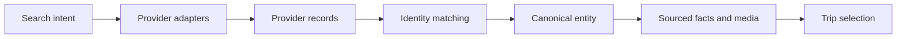

# Provider grounding and provenance

Vacay uses models to interpret and compose travel information, not to invent availability, prices, places, or sources.

## Normalization pipeline

Provider records are normalized into canonical destinations, airports, properties, attractions, activities, and events. A provider identity link retains the original record identifier and source even after several providers enrich the same entity.

## Matching rules

Matching prefers exact provider references, then normalized identity and geography. Similar names are insufficient when locality or coordinates conflict.

Every selected visual or factual claim retains the available:

- Provider and provider record identifier
- Canonical entity identifier
- Source URL and host
- Attribution or license
- Confidence and freshness information

## Failure behaviour

The system does not silently replace a required provider failure with weaker model knowledge. It can retry, use an explicitly permitted alternative, or show that current evidence was unavailable.

## Cost controls

Provider budgets are shared through PostgreSQL rather than kept in one server process. The runtime checks fresh cached data before acquiring a quota slot and records request telemetry for later analysis.

The model receives only the provider data needed for the current decision. Editing one activity does not resend the complete trip or re-query unrelated providers.

## Public boundary

This case study discusses shared adapter contracts and provider categories. It excludes credentials, private rate limits, partner terms, production request logs, and provider-specific operational code.

