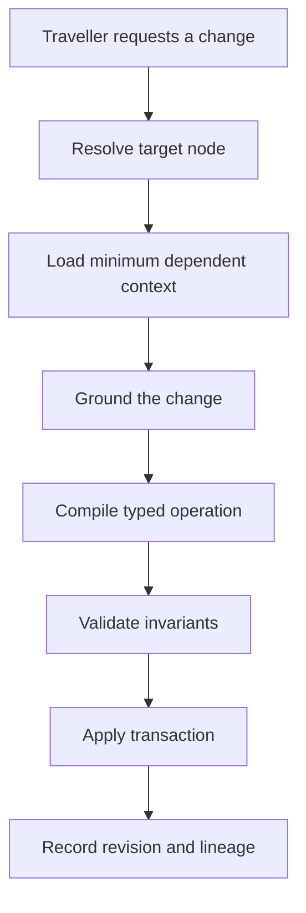

# Targeted trip-graph mutations

A trip is a graph of decisions with different identities and lifecycles. Treating the whole itinerary as one generated document makes a small edit destructive.

## Graph model

Every trip node has a stable identifier, type, section, position, revision, and parent relationship. Edges represent planning relationships that must survive serialization.

Typical node types include:

- Destination and route stop
- Stay and room option
- Activity and event
- Transport segment
- Budget item, booking, or checklist entry

## Patch lifecycle

An existing trip accepts typed `add`, `replace`, and `remove` operations. Replacing a node preserves its stable identity. Deletion creates a lifecycle and revision record instead of disappearing through full regeneration.

## Transaction boundary

The graph projection, compatibility snapshot, node revision, patch record, and affected artifact lineage update in one transaction. Unchanged nodes retain their revision and prompt-cache eligibility.

## Validation questions

1. Is the target node or section explicit?
2. Does the operation preserve stable identities and valid edges?
3. Are provider facts attributable?
4. Is cache invalidation limited to affected graph slices?
5. Can the operation be retried idempotently?

The public [`targeted-trip-patch.ts`](../examples/targeted-trip-patch.ts) example demonstrates the validation shape without exposing the private domain schema.

